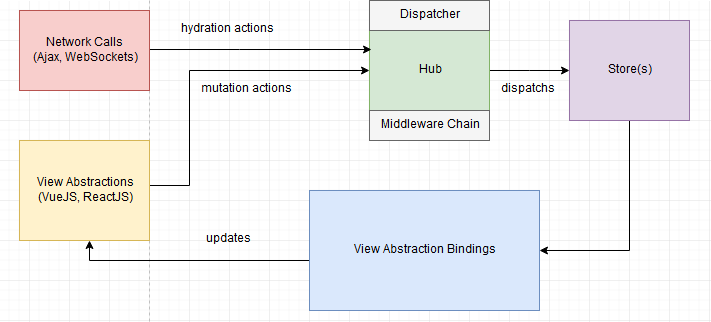
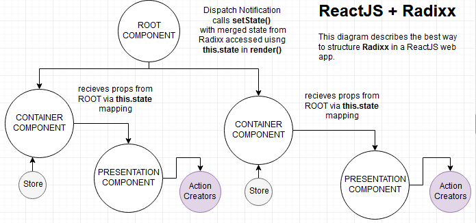

# Radixx

[]() [](https://travis-ci.org/isocroft/Radixx) [](http://nodejs.org/download/) [](https://www.npmjs.com/package/radixx)
[](https://www.npmjs.com/package/radixx) [](https://github.com/isocroft/Radixx/issues) [](https://github.com/isocroft/Radixx/blob/master/LICENSE.md) [](https://github.com/isocroft/Radixx/graphs/commit-activity) [](https://github.com/acekyd/made-in-nigeria) [](https://gitter.im/isocroft_Radixx/?utm_source=badge&utm_medium=badge&utm_campaign=pr-badge&utm_content=badge)

This is a simple Javascript library that implements the **Facebook Flux Architecture** with a twist to how the entire application state is managed, changed and updated. It resembles **Redux** in a lot of ways. The key deferentiator in both is that **Radixx** utilizes an _actions stack_ and **Redux** utilizes an immutable _state tree_. A single state tree can grow big really fast for a single store but an actions stack grows subtlely for a number of stores when dealing with complex single-page applications(SPAs). The actions stack allows **Radixx** to *<q>recalulate</q>* any state at anytime on demand. It is also how **Radixx** maintains it's _immutablility_.



## File Size 

The footprint for **Radixx** is really small. With all it's functionality, it's just 19KB when minified!

- 48.5 KB (Current Version - Unminified)
- 19.3 KB (Current Version - Minified)

</img>

## How to Use - < 2 steps >

- First, download/install it from **NPM** or **Yarn**

[NPM][npm-url] [Download][downloads-url]

```bash

	$ npm install radixx --save
```

```bash

	$ yarn add radixx
```

- Next, use it in your JavaScript application like so: 

```html

<!DOCTYPE html>
<html id="demo_app">
<head>
	<title>Radixx (Vanilla JS) - Example App</title>
	<!-- relative path (NodeJS)
	<script type="text/javascript" src="node_modules/radixx/dist/radixx.min.js"></script> -->
	<!-- absolute path (Unpkg) via CDN -->
	<script type="text/javascript" src="https://unpkg.com/radixx@0.1.2/dist/radixx.min.js"></script>
	<script type="text/javascript">
	;(function(w, r){

		r.onDispatch(function(app_state){
			/* fired when all synchronous/asynchronous 
				mutations are completely done on the state */
			console.log(JSON.stringify(app_state)); 
		});

		r.configure({
			runtime:{ /* The feature/functionality that the {runtime} config controls is still EXPERIMENTAL */

				spaMode:true, 
							/* - {runtime.spaMode} 

								setup for whether or not you're building a SPA web app (e.g. using VueJS / ReactJS ) 

								if {runtime.spaMode} is set to `false`, Radixx will automatically setup (internally) its
								ASMLC [ Application State Management Life Cycle ] procedures.

								This ensures that you are able to be notified when the page is about to be unloaded
							*/
				shutDownHref:'/'
							/* - {runtime.shutDownHref}

								makes it trivial to trigger the the shutdown callback/handler set by `Radixx.onShutdown`.
								This config should be set to the value of the `href` or `data-href` attribute of a link or
								button that triggers/signals the end of the web application session (e.g a logout button) 
						
							*/
			},
			universalCoverage:true, 
									/* - {universalCoverage}
										
										make store state changes in one tab available across browser tabs 
										and update the state on the other tabs (pages) accordingly 
									*/
			autoRehydrate:true, 	
									/* - {autoRehydrate}

										automatically hydrate all stores with their respective state data 
										upon config initialization so that your state is available to all
										stores as soon as your components load without having to retrieve
										data over the network. 

										Great for PWAs!! :)
									*/
			persistenceEnabled:false, 
									/* - {persistenceEnabled}

										make your state change persist even after the browser is closed

										You don't need this config to persist state within the same browser
										session (i.e. across page loads/refreshes).

										IMPORTANT: 
											Once {universalCoverage} is set to `true`, 
											the value of {persistenceEnabled} is automatically set to `true` 
									 */
			localHostDev:true 		
									/* - {localHostDev}

										Works as a helper config that's used with {universalCoverage} for when [Radixx] is
										used in a 'localhost' developement environment. If Radixx is used in a production app,
										set this config to `false`.

										Whenever this config is set to `true`, it's important an 'id' attribute on the <html>
										tag with a unique value.  
									*/
		});

		var registeredStores = [];
		
		/* 
			creating action creators - [ multiple actions can be created for a real-life application ]
		*/
		w.action_creators = r.makeActionCreators({
				loadTodos:{
					type:'LOAD_TODOS',
					actionDefinition:Radixx.Payload.type.array /* Filter & Validate action data as `array` for every dispatch */
				},
				saveTodo:{
					type:'SAVE_TODO',
					actionDefinition:Radixx.Payload.type.object /* Filter & Validate action data as `object` for every dispatch */
				}	
	 	});

	 	/*

			Middlewares allow you to modify the existing action data in sequence until it
			gets dispatched to all available stores.

			PS: You can only access the `nextState` (latest application state) in the last
				attached middleware (according to the order in which the middlewares were attached)

				If you MUST access the `nextState` in the remaining middleware(s) other than 
				the last one, then return the `nextState` from the last attached middleware
	 	*/

		r.attachMiddleware(function(next, action, prevState){

					let promise = new Promise((resolve, reject) => {

						if(action.actionType === 'PUSH_DOWN'){
						
							if(action.actionData.expired === true){
								
								setTimeout(() => {	

								 		var data = {
								 			name:'whatever'
								 		};

								 		resolve(
								 			data
								 		); 

								}, 4500);
								
							}else{

								resolve(
									action.actionData
								)
							}
						}

					});
			
					promise.then(function(data){

						/* 
							signal to Radixx that it should call the next middleware 
							callback or dispatch to all stores.
						*/

				 		action.actionData = data;
						
						var result = next(
			 				action,
			 				prevState
			 			);

			 			console.log(result.nextState); // To access the `nextState` from the next middleware callback
		 			});

		});

		/*

			A Logger Middleware - logs to the browser console!
		*/

		r.attachMiddleware(function(next, action, prevState){

			console.log('action-data', action.actionData);

			console.log('action-type', action.actionType);

			console.log('before-action', prevState);

			var nextState = next(
				action,
				prevState
			);

			console.log('after-action', nextState);

			return {
				nextState:nextState, // returned to the previous middleware callback
				logType:'local'
			};

		});

		
		/* creating a store - [ however, multiple stores can be created for a real-life application ] */

		/* 
			there's a strict structure to how to define a store callback - MUST recieve 2 arguments (the action object and state object) and always return the new state object 

		 	store callbacks generally SHOULD be pure functions (having no side effects)
		*/

		/*
			 As from version 0.1.0+ of Radixx, the second argument is no longer an object with 
			 getters/setter (formerly named - area).

			 Now, the second argument is the state object itself
		 */
		w.store = r.makeStore('todos', function(action, state){
						
						var todos = state; 
						
						switch(action.actionType){
							case 'LOAD_TODOS':
								// action.actionData MUST be an array as seen
								// from the action.loadTodos([ ... ]) call below
								todos = state.concat.apply(action.actionData, ["empty"]);
							break;
							case 'SAVE_TODO':
								todos.push(action.actionData);
							break;
							default:
								return null; // if control reaches here, then state didn't change at all !
							break;
						}

						return todos;
		}, []);

		// setup a function to listen for change to the store
		store.setChangeListener(function(actionType, actionKey){

			// the this reference in here is the store itself
			alert("STORE AFFECTED: " + this.getTitle());
		});

		// do something with each store created
		r.eachStore(function(store, next){

			// get the title of the store and push into an array
			registeredStores.push(store.getTitle());

			// move to the next store that has been created and do same as above with it (very useful for asynchronous code)
			next();
		});

		/*
			 hydrate all stores simultaneously at page load for the entire app 
			 (example custom logic for web app) after ajax request.
		*/

		var Application = {
				loadAllState:function(httpresponse){
					
					// hypotectical REST/GraphQL endpoint data

					return r.eachStore(function(store, next){
						
						// hydrate each store in one after the other
						// using the `next()` function 

						// This can also be used in an asynchronous fashion
						next(store.hydrate(httpresponse.data[store.getTitle()]));

					});
				},
				ajaxRequest:function(options){

					const promise = new Promise((resolve, reject) => {

								// We are trying to find out if all stores
								// were auto-rehydrated from the persistent storage
								// if so, we don't need to make any AJAX request to
								// retrieve data over the network. Why?

								// because our stores already have the state data needed
								// to power our application.
								if(r.isAppStateAutoRehydrated()){
									return resolve("okay!");
								}

								// Go over the network to retrieve data 
								// if our all stores were not auto-rehydrated

								var xhr = new XMLHttpRequest();

								xhr.setRequestHeader("Accept", "application/json, text/plain");

								xhr.onload = function(e){
									resolve(xhr.responseText);
								};

								xhr.onerror = function(e){
									reject(xhr.statusText);
								}

								xhr.open(options.url, options.type, true);

								xhr.send(options.data);
					});

					return promise;
				}
		};

		Application.ajaxRequest({
			url:"read/all/models",
			type:"GET",
			data:null
		}).then(function(res){
			if(res !== "okay!"){
				return Application.loadAllState(
							JSON.parse(res)
				);
			}
			return res;
		});

		// Setup `shutdown` handler which is triggered whenever the shutdown-href
		// is clicked or the page is unloaded
		r.onShutdown(function(appState){

			var self = this; // The `Radixx` object is captured in `this`

			// Here, we are sending all the data taken
			// from all the stores {appState} to the
			// server just before the page unloads completely
			return Application.ajaxRequest({
				url:"write/all/models",
				type:"PUT",
				data:appState
			}).then(function(){
				// remove the auto-rehydration state from the
				// perstsent storage
				self.purgePersistentStorage();
			});
		});

		// swapping the store callback with a new one

		store.swapCallback(function(action, state){
				
				var todos = state; 
				
				switch(action.actionType){
					case 'LOAD_TODOS':
						/* 
							setting up the format the state data should be stored before
							it is put in storage. since all store data is stored in JSON
						*/ 
						todos.toJSON = function(){
							
							var todoTimeToDueDate = (new Date*1),
								alltodos = this.concat.apply(action.actionData);

								return alltodos.map(function(todo){
									
									return {
										is_overdue:todoTimeToDueDate > todo.due_date_timestamp,
										todo:todo
									};

								});
						};
					break;
					default:
						return null;
					break;
				}

				return todos;
		});

		console.log("stores registered: ", registeredStores.toString(), registeredStores.length);

	}(this, this.Radixx));	
	</script>
</head>
<body>
	<ul id="todos">
	</ul>
	<button type="button" disabled="disabled" id="undo-btn">
		UNDO
	</button>
	<script type="text/javascript">

		;(function(w, d){

			// calling an action - an action triggers changes in the store (by extension the application state)
			w.action_creators.loadTodos([
				{
					text:'Buy flowers for my fiancee', 
					completed:true,
					due_date_timestamp:1491144056023
				},
				{
					text:'Prepare that website re-design proposal',
					completed:false,
					due_date_timestamp:1491144702573
				}
			]);


			var mount_point = d.getElementById("todos");
			var button = d.getElementById("undo-btn");
			
			function render(m){
					var list = w.store.getState();
					var li = null;

					if(list.length == 0){
						m.innerHTML = "";
						return;
					}

					list.forEach(function(item, i){
						li = d.createElement("li");
						li.setAttribute("data-key", i);
						li.setAttribute("data-todo-overdue", item.is_overdue);
						li.setAttribute("data-todo-done", String(item.todo.completed));
						li.appendChild(d.createTextNode(item.todo.text));
						m.appendChild(li);
					});
			}		

			button.disabled = !w.store.canUndo();
			button.onclick = function(e){
				// undo application state changes
				w.store.undo();
				this.disabled = !w.store.canUndo();
				render(mount_point);
			};

			render(mount_point);

		}(this, this.document));
	</script>
</body>
</html>
```


## DOCUMENTATION - Radixx APIs (Methods)

These are methods defined on the global **Radixx** object

- **Radixx.attachMiddleware(** _Function_ middlewareCallback **)** : _void_

> Used to intercept actions that are dispatched by action creators to stores and/or modify action data where necesssary before they reach the store.

- **Radixx.isAppStateAutoRehydrated(** _void_ **)** : _boolean_

> Used is interogate the auto-rehydration process to find out if the application state data was restored from the persistent storage on the client-side or not.

- **Radixx.makeActionCreators(** _Object_ actionTagMap **)** : _object_ {RadixxActionCreator}

> Used to create an action creators (in Flux Architecture parlance). An object literal having the action method names (as key) and the action tag (as value) is passed into this api method.

- **Radixx.makeStore(** _String_ storeTitle, _Function_ storeCallback [, _Array|Object_ initialStoreState] **)** : _object_ {RadixxStore}

> Used to create a store to which action will be sent using action creators.

- **Radixx.purgePersistentStorage(** _void_ **)** : _void_

> Used to delete all the persisted data for auto-rehydration. 

- **Radixx.onShutdown(** _Function_ shutdownListener **)** : _void_

> Registers a listener that is called whenever Radixx automatically destroys all its stores internally due to a `shutdown-href` trigger.

- **Radixx.onDispatch(** _Function_ dispatchListener **)** : _void_

> Registers a listener that is called whenever an action is disptached to the Hub (also called the `Dispatcher` in Flux Architecture parlance).

- **Radixx.eachStore(** _Function_ storeIterator **)** : _void_

> Used to call a function on each store created by Radixx and perform some operation on that store (operation is defined with the storeIterator).

- **Radixx.configure(** _Object_ configurationObject **)** : _void_

> Used to configure the Radixx store(s). 

### ----------------------------------------------------------------------------------------------------------------

## Radixx Configuration Options

- **runtime.spaMode** {boolean} [ EXPERIMENTAL FEATURE ]

> Whether or not the app in an SPA (Single Page Application). If the app is a SPA, then the _shutDownHref_ option doesn't have any effect.

- **runtime.shutDownHref** {string} [ EXPERIMENTAL FEATURE ]

> The Href/Link upon which Radixx should destroy all stores and automatically shutdown state tracking. Also triggers the "Radixx.onShutDown()" handler function set prior to call.

- **universalCoverage** {boolean}

> Makes it possible to replicates state changes across multiple browser tabs/windows

- **persistenceEnabled** {boolean}

> Makes it possible to persist application state across browser session

- **autoRehydrate** {boolean}

> Makes it possible to restore persisted state data into all pre-existing stores

### ----------------------------------------------------------------------------------------------------------------

## Radixx APIs (Properties)

- **Radixx.Helpers**

> Used to provide ancillary logic to SPA framework/library compoenents (e.g. ReactJS)

- **Radixx.Payload.type.boolean**

> Used to signify that action creator method argument/payload MUST always be of type: Boolean

- **Radixx.Payload.type.string**

> Used to signify that action creator method argument/payload MUST always be of type: String

- **Radixx.Payload.type.array**

> Used to signify that action creator method argument/payload MUST always be of type: Array

- **Radixx.Payload.type.object**

> Used to signify that action creator method argument/payload MUST always be of type: Object

- **Radixx.Payload.type.date**

> Used to signify that action creator method argument/payload MUST always be of type: Date

- **Radixx.Payload.type.function**

> Used to signify that action creator method argument/payload MUST always be of type: Function

- **Radixx.Payload.type.number**

> Used to signify that action creator method argument/payload MUST always be of type: Number

- **Radixx.Payload.type.nullable**

> Used to signify that action creator method argument/payload MUST always be of type: Null or Undefined

- **Radixx.Payload.type.any**

> Used to signify that the action creator method argument/payload CAN BE of any type EXCEPT: Null or Undefined

- **Radixx.Payload.type.numeric.Int**

> Used to signify that action creator method argument/payload MUST always be a Integer number

- **Radixx.Payload.type.numeric.Float**

> Used to signify that action creator method argument/payload MUST always be a Floating-Point number

### ----------------------------------------------------------------------------------------------------------------

## Store APIs

These are methods defined on the store object from **Radixx.makeStore( ... )** call

- **store.hydrate(** _Array|Object_ initialStoreData **)**

> Used to put/insert/overwrite state data in the store directly without using an action creator. This call affects only the store in context. However, whenever actions are dispatched by an action creator, they affect all stores in the web application.

- **store.getTitle(** _void_ **)**

> Used to retrieve the storeTitle used in creating the store.

- **store.getState(** _void|String_ stateKey **)**

> Used to retrieve the current state of the store.

- **store.makeTrait(** _Function_  traitFactory **)**

> Used to create data items which are based on the store.

- **store.setChangeListener(** _Function_ changeListener **)**

> Used to register a listener (callback) that is called whenever the state of the store changes

- **store.unsetChangeListener(** _Function_ changeListener **)**

> Used to unregister a listener (callback)

- **store.undo(** _void|Number_ timeSpan **)**

> Used to undo a state change to the store

- **store.redo(** _void|Number_ timeSpan **)**

> Used to redo a state change to the store

- **store.swapCallback(** _Function_ newStoreCallback **)**

> Used to hot swap / replace a store callback

- **store.destroy(** _void_ **)**

> Used to remove store state data from sessionStorage (manually)

- **store.disconnect(** _void_ **)**

> Used to disbale the store from recieving dispatch from action creators methods


## Features

- Infinite/Finite Undo/Redo + Time Travel 
- Use of Traits (as Mixins) for ReactJS and VueJS (even though most people think _mixins_ are dead and composition should be the only thing in used, i still think mixins have a place)
- Can replace the store callback (similar to **replaceReducer()** in _Redux_)
- Can overwrite store state data on the fly using **hydrate()**
- An extended Loose Coupling between Radixx Dispatcher and Controllers/Components.
- A transparent way for separating mutation, dependence and asynchronousity in application state management.
- No need to **<q>emit</q>** change events from within a store registration callback.
- No unecessarily elaborate definition for **Action Creators** &amp; **Stores** (Write less code).
- No need to use immutableJS library to help manage application state changes (Require state on demand).
- The **Dispatcher** object is hidden and all you have is a **<q>Hub</q>** object.
- Includes an **<q>onDispatch</q>** event that exposes the entire global application state (from all stores).

## Benefits

- Use with Single Page App Frameworks/Libraries e.g. VueJS 1.x/2.x, AngularJS 1.x, Angular 2.x, Ractive, ReactJS, jQuery
- Use with Multi Page App Frameworks as well e.g Django, Jollof, Pheonix, Laravel, Flask, AdonisJS (application state persists across page(s) load/reload)

## Best Practices (Dos and Don'ts)

- Application UI State {a.k.a Volatile Data} -- **don't store** this in Radixx stores (e.g. Text Input - being entered, Animation Tween Properties/Values, Scroll Position Values, Text Box Caret Position, Mouse Position Values, Unserializable State - like functions)
- Application Data State {a.k.a Non-Volatile Data} -- **do store** this in Radixx stores (e.g. Lists for Render fetched from API endpoints, any piece of Data displayed on the View)

> NOTE: When using Radixx with ReactJS, it is best to ascribe/delegate Application UI State to {this.state} and {this.setState(...)} and Application Domain Data State to {this.props} respectively. One reason why Radixx recommends this approach is to avoid confusion as to when {this.setState} calls actually update both the DOM and {this.state} since {this.setState} is sometimes _asynchronous_ in the way it operates.

# Caveats/Gotchas

- Radixx would not maintain state across multiple tabs in a browser except the  **<q>universalCoverage</q>** config option is set to **true**.
- Radixx throws an error if the **<q>runtimeMode</q>** config option
- Always call the **Radixx.configure()** method before creating action creators and stores. If you don't want to change the default configuratio for **Radixx**, simply call **Radixx.configure({})**.
- Radixx would not access the storage objects where necessary if it is placed in an iframe that has very tight _sandbox attribute_ restrictions or does not have the same scheme and domain as the parent window (same-origin policy restrictions) except a reverse proxy tactic or the [domain hack](http://qnimate.com/same-origin-policy-in-nutshell/) is used.


## About Redux (with respect to Radixx)

Hers's how **Redux** is simply described

> Redux is basically event-sourcing where there is a single projection to consume the application state (think CQRS - Command Query Responsibilty Segregation).

Someone had this to say about the state of **Redux** single store

> I'm also not impressed about every action having to go “all the way” upwards (to the central store) instead of short-circuiting somewhere.

That being said, here is a round-up of what makes **Redux** a GREAT tool (for some use cases) and what doesn't make it so ideal (for all use cases)

# Gains of Redux single store

- Infinte Undo/Redo + Live-Editing Time Travel (As application state is immutable).
- Predictable Atomic Operation on Application state object (As actions are run in a specific predictable order).
- Single source of truth (No Guesswork!!) for applicaton state.

Same applies to Radixx

# Troubles with Redux single store

- A sizable amount of boilerplate code (especially with **connect()** and/or **mapStateToProps()** from _react-redux_ project library) is required to get Redux up and running.
- Dynamically structured state is impossible. (mature, complex apps need this the most).
- Increased probability of state key(s) collisions between reducers (very likely in a big complex web app but highly unlikely in samll ones).
- Global variables are always a bad thing (This applies to the composition of the Redux application state itself) as you could `clobber` them unknowingly.
- Performance suffers as your state tree gets larger (Immutability is a good thing...sometimes).
- Each time the **connect()** decorator is called, it pulls in the entire application state (when using _react-redux_ project library).


_Your best bet in all these is to choose the trade-offs wisely (depending on the peculiarities of the web app you're building)_. In order words, Choose what you can live with and what you can't live without when it comes to having a store in your application.


> NOTE: **Radixx** is not an outright drop-in replacement for **Redux** or **Vuex** but a nice alternative when **Redux** or **Vuex** doesn't quite fit your use case.


## Tests

This project uses **Jasmine** for tests and runs them on the command line with **Karma** .You can run to check the quality of code written by running the tests in 2 ways

1. run the following command in the root folder after cloning the repo

```bash

	$ npm install

	$ npm run test
```

2. open the _tests/specRunner.html_ file in any browser of your choice using the file:/// protocol


## Examples

>VueJS 1.x/2.x

```js

	var action_creators = Radixx.makeActionCreators({
			'addStuff':{
				type:'ADD_STUFF',
				actionDefinition:Radixx.Payload.type.string
			}
	});

	var store = Radixx.makeStore('stuffs', function(action, state){
			
			var stuffs = state;

			switch(action.actionType){
				case 'ADD_STUFF':

					/* action.actionKey is 'profile' */

					if(action.actionKey
						&& !!stuffs[action.actionKey]){
						stuffs[action.actionKey].fullName = action.actionData;
					}

				break;
				default:
					return null;
				break;
			}

			return stuffs;
	}, {
		profile:{
			fullName:'John',
			phone:'08011111111'
		}
	});

	var trait = store.makeTrait(function(store, callback){

			var __callback;

			return {
				_loadAppData:function(){

					// an ajax call may come in here ...

					/*	
						from an ajax call response, if an empty object literal was passed (as third argument) to `Radixx.createStore` call (above), then, we can call `hydrate` on the store object here passing it the requisite data from the ajax response

						Assuming `axios` is loaded

					*/

					if(!Radixx.isAppStateAutoRehydrated()){
						axios.get('/get/data')
							.then(function( ajaxResponseData){
								store.hydrate( ajaxResponseData );
						})
							.catch(function(error){

						});
					}
				},
				beforeCreate:function(){
				
					Radixx.configure({
						autoRehydrate:true
					});

					this._loadAppData();

				},
				created:function(){

					const _this = this;

					// register a dispatch listener...

					Radixx.onDispatch(function(appState){

						// do stuff with `appState`

						 var componentName = _this.$options.name;

						 console.log(appState[componentName]);

					});

				},
				beforeMount:function(){

					const _this = this;

					// register a middleware callback...

					Radixx.attachMiddleware(function(next, action, prevState){

						var nextState = next(
							action,
							prevState
						);
						
						// you could chose to emit an event here too..
						_this.$emit('middlewareEvent', {});
					});

				},	
				mounted:function(){

					__callabck = callback(this);

					store.setChangeListener(__callback);
				},
				beforeUpdate:function(){


				},
				destroyed:function(){

					store.unsetChangeListener(__callback);
				}
			};

	}, function(component){

		return function(actionType, actionKey){

			// used the store change listener for side effects only

			switch(actionType){
				case "ADD_STUFF":

					alert("Stuff has been added successfully...");

				break;
			}
		};

	});

	// A Vue Component defined with lifecycle hooks via mixins (Radixx store traits)

	const MyVueComponent = {
			name:'stuffs', /* The name of the component could be the same as that of the store */
			mixins:[trait],
			prop:{
				claim:{
					type:String,
					required:true
				}
			},
			template:`<div>
						<p>{{componentState.profile.fullName}}</p>
						<input type="text" v-model="firstName">
						<input type="number" v-model="phone">
						<button v-on:click="add" v-bind:disabled="buttonDisabled" v-bind:title="gender">ADD</button>
					</div>`,
			computed:{
				componentState:function(){

					return store.getState();
					
				}
			},
			watch:{
				phone:function(newval, oldval){

					// code goes here... 
				}
			},
			data:function(){

				/*
					Only UI state (transient) should go in here

					No core application state should be here
				*/

				return {
					buttonDisabled:false,
					firstName:'',
					phone:''
				};

			},
			methods:{
				add:function(){

					/* 
						calling an action to write data into our store
						and trigger an update on the view/store change event, 
						here we are writing to `fullName` with a value of `this.firstName`

					*/

					action_creators.addStuff(this.firstName, 'profile');
				}
			}
	});

	/*
		For communication between one or more components, the props and events of VueJS
		come in very handy
	*/

	// See: https://vuejs.org/v2/guide/components.html#Composing-Components


	var app = new Vue({
			el:'#app',
			components:{
				'my-component':MyVueComponent
			}
	});


```

```html

	<div id="app">
		<my-component claim="basic"></my-component>
	</div>

```

>AngularJS 1.x

If you are using **Radixx** with **AnugularJS / Angular 1.x**, then you need to include the provider made available in this repo (_ng-radixx.js_) and imprt/inject it into the `config` function like as below using '$ngRadixxProvider' name.

```js

// Top-level Module { Using the Angular 1.x Provider Helper - $ngRadixx }

angular.module("appy", [ 
			'ui.router',
			'appy.todos'
])
.config(['$stateProvider', '$urlRouterProvider', '$ngRadixProvider', '$locationProvider',
	function($stateProvider, $urlRouterProvider, $ngRadixxProvider, $locationProvider){

		$locationProvider.html5Mode(true);

		$stateProvider

		.state({
			url: '/',
			template: '<site></site>'
		})

		.state({
			url: '/user',
			template: '<app></app>',
			controller:'TodoCtrl'
		});

		$urlRouterProvider.otherwise('/');

		$ngRadixxProvider.configure({
			runtime:{
				spaMode:false,
				shutDownHref:'/#/logout'
			},
			universalCoverage:true,
			autoRehydrate:false,
			persistenceEnabled:true
		});

		$ngRadixxProvider.attachMiddleware(function(next, action, prevState){
			// ....
		});
});


// Domain-level Module

angular.module("appy.todos", [
			'ngRadixx',
			'ngSanitize',
			'pouchdb' /* using [angular-pouchdb] module */
])

.factory("$todoAction", ['$ngRadixx',

	function($ngRadixx){

	var action_c_mappings = {
		'loadTodos':{
			type:'LOAD_TODOS',
			actionDefinition:Radixx.Payload.type.array
		},
		'addTodo':{
			type:'ADD_TODO',
			actionDefinition:Radixx.Payload.type.object
		},
		'removeTodo':{
			type:'REMOVE_TODO',
			actionDefinition:Radixx.Payload.type.numeric.Int
		}
	};
	
	/* create an action object with all necessary action names */

	return $ngRadixx.makeActionCreators(
		action_c_mappings
	);

}]) 

.factory("$todoStore", ['$ngRadixx',

	function($ngRadixx){
	
	return $ngRadixx.makeStore(
		'todos',
		register,
		[]
	);

	function register(action, state){
		
		var todos = state;

		switch(action.actionType){
			case 'ADD_TODO':
				todos.push(action.actionData);
			break;
			case 'LOAD_TODOS':
				todos = state.concat.apply(action.actionData);
			break;
			case 'REMOVE_TODO':
				todos.splice(action.actionData, 1);
			break;
			default:
				return null;
			break;
		};

		return todos;
	};

}]); 

.factory('$fetch', ['$http', '$q', 'pouchDB', function($http, $q, pouchDB){
	
	return: {
		getTodos:function(url){
			var localdb = pouchDB('todos');
			return localdb.allDocs({
				include_docs:true,
				attachments:true
			}).then(function(res){
				return res.rows.map(function(row){
					return row.doc;
				});
			}).catch(function(err){
				if(err.name != 'conflict'){ 
					return $http.get(url);
				}else{
					if(err.name == 'not_found'){
						return [err];
					}	
				}
			});
		}	
	}
}]);

.controller("TodoCtrl", ['$scope', '$todoAction', '$todoStore', 'pouchDB', '$fetch'
	function($scope, $todoActions, $todoStore, pouchDB, $fetch){

		// get the 'title' for the {todos} store (a part of the application state)
		var title = $todoStore.getTitle(), 

		listen = (function(db){

				return function(storeTitle, actionKey){

					var data = this.getState();
					data._id = (new Date*1);
					
					/* store change listeners stores data in local DB */	
					db.put(data) 
					.then(function(res){

						/* Assuming to use the Pusher Realtime backend service */ 
						if(res.ok){
							return $http({
								url:'http://localhost:3248/broadcast/pusher',
								method:'POST',
								data:data
							}); 
						}else{
							throw new Error("Not OK => id:"+res.id+", rev:"+res.rev);
						}
					})
					.catch(function(err){ 
							console.log('App Error: ', err);
					});
				};

		}(pouchDB('todos')));


		/* loading todos from server DB (or local DB) */
		$fetch.getTodos('http://localhost:4002/todos/all').then(function(data){

			/* 
				calling hydrate() on a store affects only that store as
				opposed to triggering an action which affects all stores

				Here: we're triggering an action
			*/

			// $todoStore.hydrate(data.response);
			$todoAction.loadTodos(data.response);
		});

		$scope.$on('locationChangeSuccess', function(event, data){

			/* subscribe store change listener */
			$todoStore.setChangeListener(listen);
		});

		$scope.$on('$unload', function(event, end){

			if($scope.todos.isSavedToPouchDB){
				// do something with PouchDB
				
			}	

			event.preventDefault();

		});

		$scope.$on('$radixxDispatch', function(event, appState){

			/* automatically update view when a dispatch happens on the store */
			$scope.todos = state[title];
			console.log("on-dispatch: Radixx - " + JSON.stringify(appState));
		});

		$scope.$on('$destroy', function(event, data){

			/* unsubscribe store change listener */
			$todoStore.unsetChangeListener(listen);
		
		});

		$scope.addTodo = function(todo){

			$scope.todos.isSavedToPouchDB = false;
			/* this function is triggered by a button click  
				on the view and calls an action creator */
			$todoAction.addTodo(todo);
		};

		$scope.undo = function(){

			$todoStore.undo();
		};

		$scope.redo = function(){

			$todoStore.redo();
		};

		$scope.removeTodo = function(todoId){

			/* this function is triggered by a click on the view 
				and calls an action creator */
			$todoAction.removeTodo(todoId);
		};

}]).run(['$rootScope', '$window', '$ngRadixx', function($rootScope, $window, $ngRadixx){

		$ngRadixx.attachMiddleware(function(next, action, prevState){

			var nextState = next(
				action,
				prevState
			);
			
			// you can use the $rootScope to emit event here too...

		});
		
		$window.onunload = function(e){
		
			$rootScope.$emit('$unload', null);
			
		};
	
		console.log("app is good to go!");

}]);
```
>ReactJS 

```html

	<script type="text/javascript" src="https://unpkg.com/react@0.13.1/dist/react-with-addons.js"></script>

	<script type="text/javascript" src="https://unpkg.com/react@0.13.1/dist/JSXTransformer.js"></script>
```



```js
	
	/* ====================  */


 	/*!
 	 *	When using Radixx with ReactJS, There are few things you should be aware of.
 	 * 
 	 *
 	 * ReactJS and Radixx are not opinionated. This can make it tricky
 	 * to use the two together and you can get it all wrong very easily.
 	 *
 	 * Using the concept of Root, Presentation and Container components - adapted from Dan Abrahamov (creator of Redux)
 	 * it is possible to get it right when using ReactJS with as many as 12 components in a project. If you have at most
 	 * 2 components in your project then you need not use Radixx or if you do you don't really need to organize your
 	 * components into ROOT, PRESENTATION and CONTAINER components. Below is a list of guidelines to safely use Radixx
 	 * with ReactJS
 	 *
 	 *	# Only use `setState` on the ROOT and PRESENTATION Components
 	 *	# Only use `componentWillMount` on the ROOT Component (There MUST BE only 1 ROOT Component per App).
 	 * 	# Only use `shouldComponentUpdate`, `componentWillRecieveProps`, `componentDidMount`, `componentWillUnmount`, `getDefaultProps` and `mixins` on CONTAINER Components
 	 * 	# Only use `shouldComponentUpdate`, `componentWillRecieveProps`, `componentDidUpdate`, `getDefaultProps` `getInitialState` and `mixins` on PRESENTATION Components
 	 * 	# The STORE should only be attached to CONTAINER Components
 	 * 	# The ACTION_CREATOR should only be attached to PRESENTATION Components
 	 *	# The `render` method can be used on all 3 Component Categories (ROOT, PRESENTATION and CONTAINER)
 	 *	# Only use `makeTrait` method of STORE(s) to create Mixins for the CONTAINER and PRESENTATON Components
 	 * 	# Only insert UI state (which is transient and non-persistent) in the state object of PRESENTATION Components
 	 *	# The `setState` method MUST NEVER be used in CONTAINER Components
	 *
	 * You can also do without CONTAINER components and have just ROOT and PRESENTATION componets for a simpler web application
 	 *
 	 */

 	/* ===================== */ 

	/* The code belwo uses ReactJS v0.13.1 - */

	// Asuuming to use socket.io (client-side)
	var socket = io.connect(
					'http://locahost:8005/websockets', 
					{
						timeout:300000, 
						reconnection:true, 
						transports:["websockets"]
					}
	),

	/* Radixx Action Creator */
	
	actions = Radixx.makeActionCreators({
		'loadShoes':{
				type:'LOAD_SHOES',
				actionDefinition:Radixx.Payload.type.array
		},
		'removeShoe':{
				type:'REMOVE_SHOE',
				actionDefinition:Radixx.Payload.type.numeric.Int
		}
		'addShoe':{
				type:'ADD_SHOE',
				actionDefinition:Radixx.Payload.type.object
		}
	}),

	/* Radixx Store */

	store = Radixx.makeStore('shoes', function(action, state){
		
		var stub = state;
		
		switch(action.actionType){
			case 'ADD_SHOE':
				stub.shoes.push(action.actionData);
			break;
			case 'LOAD_SHOES':
				stub.shoes = action.actionData;
			break;
			case 'REMOVE_SHOE':
				stub.shoes.splice(action.actionData, 1);
				this.await([
					'clothes'
				], function(){
					
					/* assuming: custom pub/sub object for communicating 
						with other stores (not defined here) */
					E.emit('clothes', stub);
				});
			break;
			default:
				return null;
			break;
		}

		return stub;

	}, {shoes:[],jewellry:[]});
			

	/* ReactJS - Presentation Component Mixin */

	const PresentationTrait = store.makeTrait(function(store){
	
		return {
			componentWillRecieveProps:function(nextProps){
				if(nextProps.shoes.length === 15){
					if(this.state.canAddMoreShoes === true){
						this.setState({
							canAddMoreShoes:false
						}); // set state to something else...
					}
				}
			},
			shouldComponentUpdate:function(nextProps, nextState){
				return (
					!Radixx.Helpers.isEqual(this.props, nextProps) ||
					!Radixx.Helpers.isEqual(this.state, nextState)
				);
			},
			componentDidUpdate:function(){
				
				socket.emit('shoe-okay', this.props.shoes);
			},
			_post:function(_url, _data){
					
					/* Assuming `Axios` is loaded in - return the promise */

					return axios.post(_url, _data);

			},
			getInitialState:function(){

				/* 
					When using `getInitialState()`, never return Radixx store state from here. 
					you can use this to hold UI state (which should NEVER go into)
				 */

				return { // UI state ONLY
					addingShoe:false,
					canAddMoreShoes:true,
					loadingShoes:false
				};
			}	
		};

	});

	/* ReactJS - Container Component Mixin */

	const ContainerTrait = store.makeTrait(function(store, listener){

			return {
				componentWillUnmount:function(){

					/* unsubscribe store change listener */
					store.unsetChangeListener(listener);
				},
				shouldComponentUpdate:function(nextProps, nextState){
					let title = store.getTitle();
				
					return (
						!Radixx.Helpers.isEqual(this.props[title], nextProps[title]) ||
						!Radixx.Helpers.isEqual(this.state, nextState)
					);
				},
				componentDidMount:function(){

					/* Assuming use of socket.io library - joining a room */
					socket.join('shoelovers');

					/* subscribe store change listener */
					store.setChangeListener(listener);

				},
				getDefaultProps:function(){

					return {
						shoes:store.getState('shoes')
					};
				}
			};
	}, function(actionType, actionKey){


			switch(actionType){

				case "ADD_SHOE":
					
					// make an AJAX request to the server
					this._post('http://localhost:5600/shoes', this.getState('shoes')).then(function(data){
						alert("Shoe added sucessfully!");
					});
				break;
			};

	});


	/* =============================
	============================= */


	/* PRESENTATION COMPONENT */

	// defined with most lifecycle hooks
	
	/** @jsx React.DOM */

	var ShoeComponent = React.createClass({
			propTypes:{
				shoes:React.PropTypes.array
			},
			getStyle: function(){

				return {
					display:'block',
					width:'450px',
					marginLeft:'auto',
					marginRight:'auto',
					backgroundColor:'#ee321f'
				};
			},
			onKeys:function(e){

				this.setState((prevState, props) => {
					
					if(prevState.addingShoe === false){
					
						return {addingShoe:true};
					}
					
					return prevState;
				});

			},
			onSubmitForm:function(e){
				
				e.preventDefault();

				var form = e.target;

				var payload = {
					len:this.props.shoes.length,
					name:form.elements['add'].value
				};

				action.addShoe(payload);
			},
			mixins:[PresentationTrait],
			render:function(){

				var shoes = this.props.shoes.map(function(shoe){
								return <li id={shoe.type}>{shoe.name}</li>
							}), 

					_style = this.getStyle();

				return (

					<section style={_style}>
						<form className="form" onSubmit={this.onSubmitForm}>
							<input type="text" name="add" id="add" placeholder="Add Shoes..." onKeyDown={this.onKeys} />
							<button type="submit" name="add">ADD</button>
						</form>
						<ul>
							{shoes}
						</ul>
					</section>

				);
			},
			
	});


	/* =============================
	============================= */


	/* CONTAINER COMPONENT */

	// defined with no lifecycle hooks
	
	/** @jsx React.DOM */

	var ListingsContainer = React.createClass({
			mixins:[ContainerTrait],
			render:function(){

					 var _shoes = this.props.shoes;

					 return (

					 	<ShoeComponent shoes={_shoes} />

					);
			}
	});


	/* =============================
	============================= */


	/* ROOT  COMPONENT */

	// defined with fewer lifecycle hooks

	var TheApp = React.createClass({
			_loadAppData:function(){
				
				if(!Radixx.isAppStateAutoRehydrated()){

					/* Assuming `Axios` is loaded in - return the promise */

					axios.get("https://getalldata.example.com").then(function(response){
						
						Radixx.eachStore(function(store, next){

							var state = store.getState(), title = "";
							
							if(Object.isEmpty(state)){

								title = store.getTitle();

								store.hydrate(response[title]);
							}
									
							next();
						});

					}).catch(function(error){
						console.log(error);
					});
				}
			},
			componentWillMount:function(){

					/* Configure Radixx */

					Radixx.configure({
						universalCoverage:true,
						autoRehydrate:true
					});

					/* always listen for dispatches */

					let this = that;

					Radixx.onDispatch(function(appstate){

						console.log(appstate);

						that.setState(appsate);

					});

					that._loadAppData();

					
			},
			render:function(){
			
				let shoes = this.state.shoes || {};

				return <ListingsContainer shoes={shoes} />
			}
	});

	ReactDOM.render(<TheApp />, document.body, function(){
		
		console.log("app is good to go!");
	
	});
	
```

## Browser Support

- IE 9.0+ (Trident)
- Edge 13+ (EdgeHTML)
- Opera 11.6+ (Presto, Blink)
- Chrome 4.0+ (Webkit, Blink)
- Firefox 4.0+ (Gecko)
- Safari 7.0+ (AppleWebkit)

## Gotchas/Caveats

- Trying to `swap` the store callback using the **swapCallback()** method before setting a store listener using **setChangeListener()** will always throw a type error.

- Whenever you instantly fill up a store by using the **hydrate()** method, the store callback is NEVER called. Only middlewares and store state change listeners are called. Also, the data in the store is overwritten with that passed as an argument to the **hydrate()** method.

- It's COMPULSORY to call **Radixx.configure()** before your application code loads (after loading the Radixx library) else **Radixx** may not work properly or as expected. If you would like to setup **Radixx** with the default config simply call as below: 

```js

	.
	.
	.

	Radixx.configure({

	});
```

## License

MIT

## Live Projects { that use _Radixx_ for state management in production }

- [**NTI Portal**](https://my.nti.edu.ng/applicants/apply) - National Teachers Institute Kaduna - Applicants Section
- [**Stitch NG**](https://www.stitch.ng) -  Fashion Technology Product

## Contributing

Please feel free to open an issue, fix a bug or send in a pull request. I'll be very glad you did. You can also reach me on Twitter [@isocroft](https://twitter.com/isocroft). See the **CONTRIBUTING.md** file for more details.

[npm-url]: https://npmjs.com/package/radixx
[downloads-url]: https://npmjs.com/package/radixx
